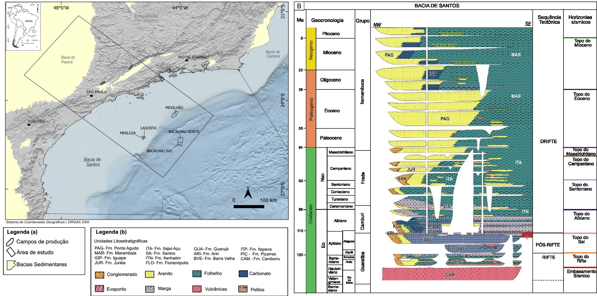
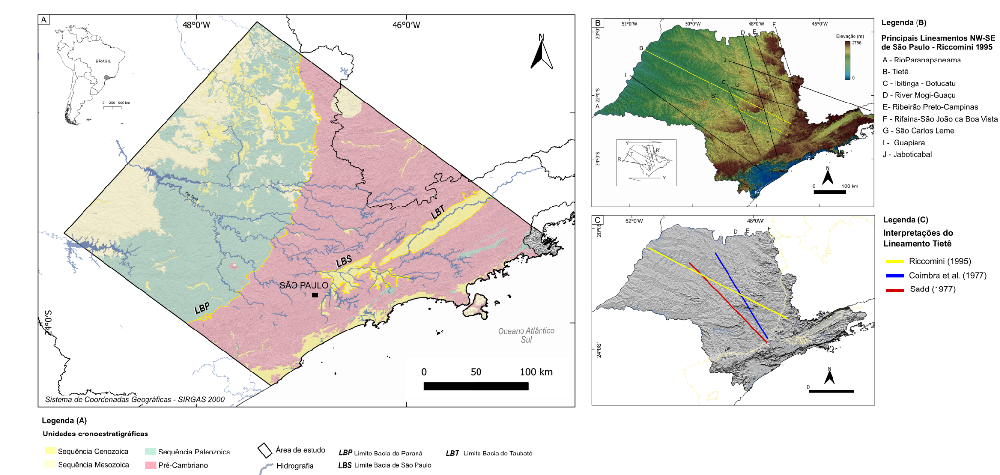
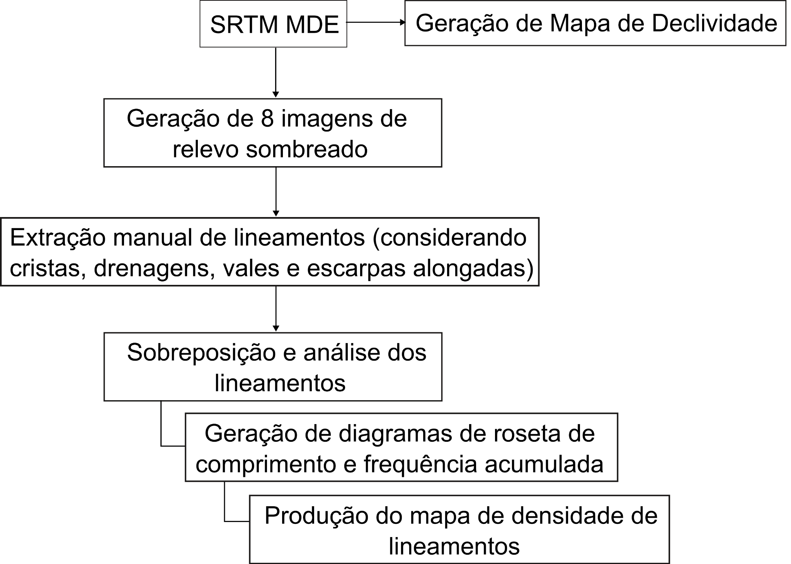
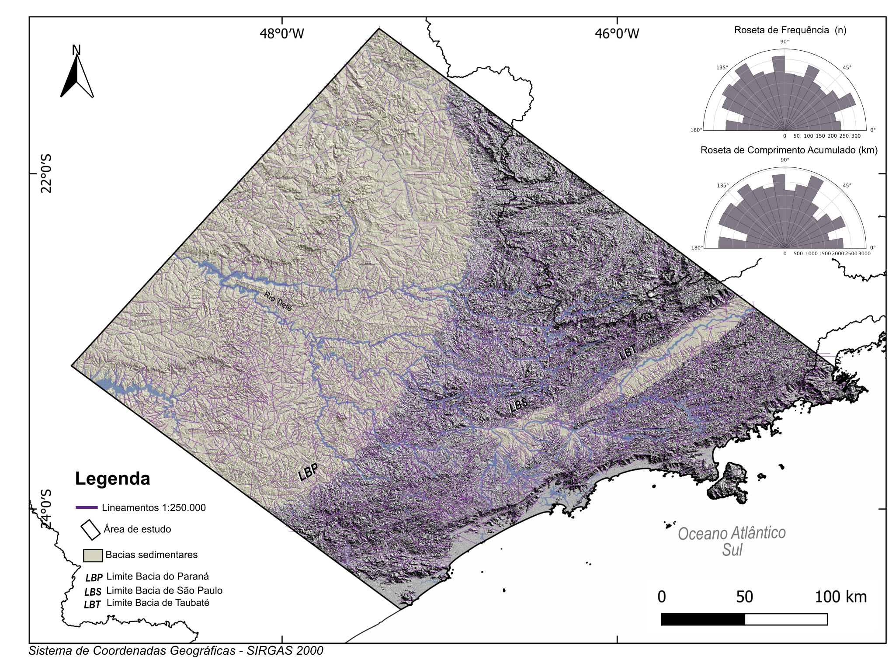
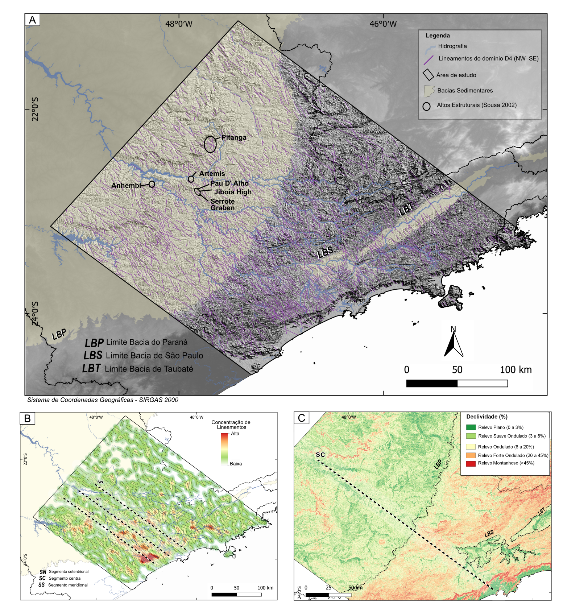
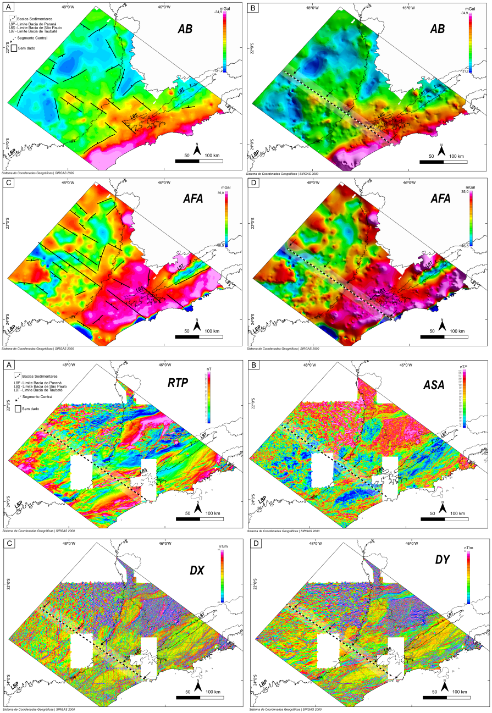
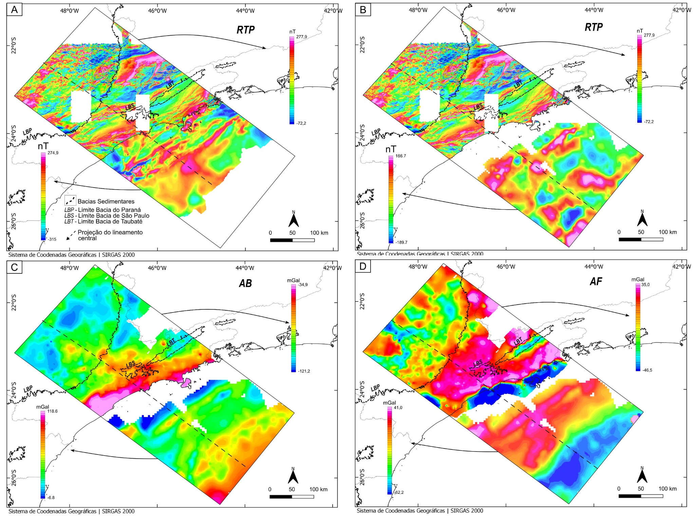
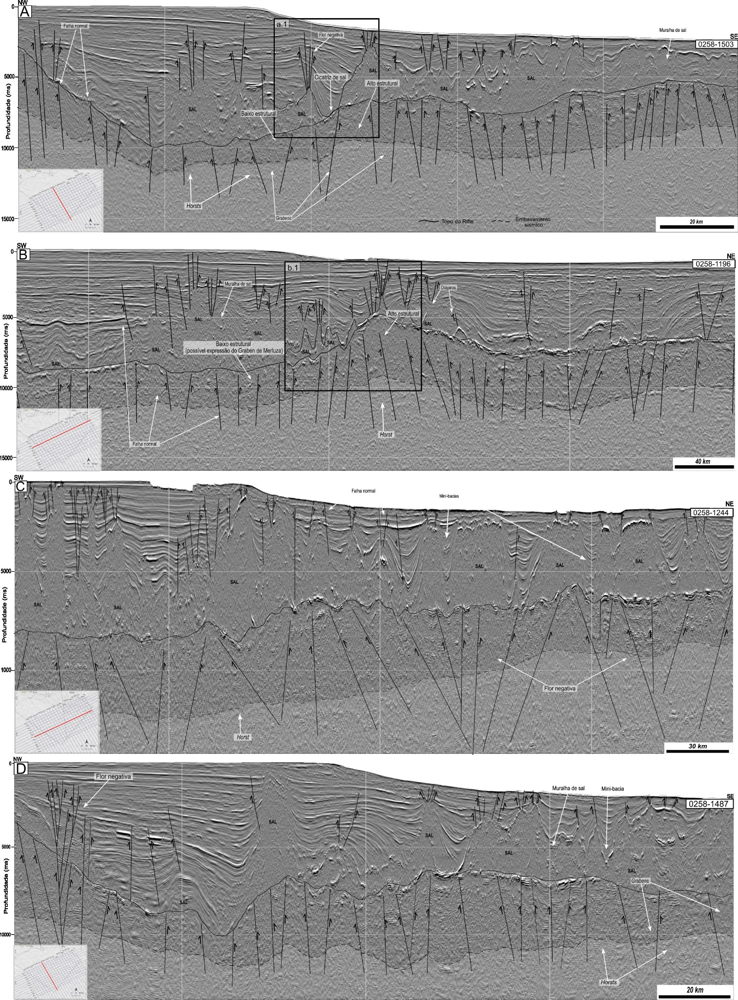
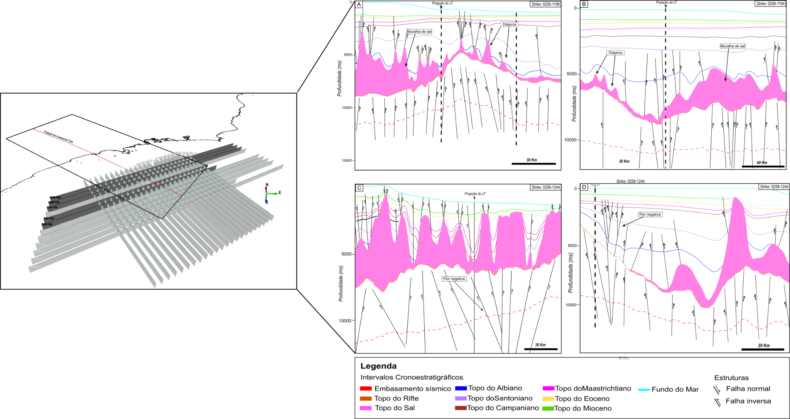

# Figuras suplementares — possível projeção do Lineamento Tietê

Material gráfico suplementar do resumo submetido ao Encontro Nacional do PRH-ANP (RAA PRH-ANP 2026), associado à dissertação de mestrado de **Danielle Simeão Silverio Rocha**.

## Visualizador interativo

[Abrir a galeria das Figuras 1–9](index.html)

A galeria apresenta uma figura por vez, com a respectiva legenda, navegação por setas, seletor e teclado. Também permite abrir a figura em tela cheia, ampliar de 50% a 500%, usar a roda do mouse, aplicar zoom com duplo clique e arrastar a imagem ampliada. O cabeçalho utiliza elementos da identidade visual do Encontro Nacional do PRH-ANP 2026 e informa que se trata de uma página complementar da autora. A marca “RASCUNHO · NÃO PUBLICADO” permanece visível durante a consulta.

## Escopo e cautela interpretativa

As nove figuras documentam os dados e as relações espaciais usados para **discutir a hipótese** de uma possível projeção do Lineamento Tietê do continente em direção à Bacia de Santos. As correspondências cartográficas, morfoestruturais, geofísicas e sísmicas apresentadas **não constituem confirmação de continuidade tectônica**. A interpretação deve ser considerada uma hipótese de trabalho, sujeita a testes adicionais.

## Figuras

### Figura 1 — Contexto regional da Bacia de Santos

[Abrir em resolução completa](figura-01-contexto-bacia-santos.jpg)

**Legenda:** (A) Localização da área de estudo na porção centro-norte da Bacia de Santos, com indicação dos principais campos, sub-bacias e feições estruturais regionais sobre o mapa do embasamento econômico modificado de Freitas et al. (2022); e (B) carta estratigráfica simplificada da Bacia de Santos, destacando as principais sequências deposicionais, fases tectônicas e horizontes interpretados. Base cartográfica elaborada pela autora a partir de dados de GEBCO (2025), IBGE, ANP/BDEP e SRTM/TOPODATA.

### Figura 2 — Contexto geológico-estrutural continental

[Abrir em resolução completa](figura-02-contexto-continental.png)

**Legenda:** Localização e contexto geológico-estrutural da área de estudo continental. (A) Distribuição das principais unidades cronoestratigráficas, bacias sedimentares e rede hidrográfica; (B) principais lineamentos de orientação NW–SE reconhecidos no estado de São Paulo, com destaque para o Lineamento Tietê; e (C) comparação entre diferentes posicionamentos cartográficos atribuídos ao Lineamento Tietê por Coimbra et al. (1977), Riccomini (1995) e Saad (1977). As unidades geológicas foram compiladas a partir de dados do Serviço Geológico do Brasil (SGB), disponibilizados pela plataforma GeoSGB.

### Figura 3 — Fluxograma de extração e análise dos lineamentos

[Abrir em resolução completa](figura-03-fluxograma-lineamentos.png)

**Legenda:** Fluxograma dos procedimentos empregados no processamento dos dados SRTM e na interpretação morfoestrutural dos lineamentos, adaptado com base nas metodologias descritas por Souza (2008), Bricalli (2016) e Ndatuwong (2022). A partir do modelo digital de elevação foram produzidos o mapa de declividade e oito modelos de relevo sombreado, utilizados na extração manual, sobreposição e análise dos lineamentos, na elaboração dos diagramas de roseta e na geração do mapa de densidade.

### Figura 4 — Distribuição espacial dos lineamentos continentais

[Abrir em resolução completa](figura-04-distribuicao-lineamentos.png)

**Legenda:** Distribuição espacial dos 4.731 lineamentos interpretados a partir de produtos SRTM, em escala 1:250.000, na porção continental da área de estudo. Os diagramas apresentam a frequência das orientações e o comprimento acumulado dos lineamentos em classes angulares de 10°. LBP: limite da Bacia do Paraná; LBS: limite da Bacia de São Paulo; LBT: limite da Bacia de Taubaté.

### Figura 5 — Expressão espacial do domínio NW–SE

[Abrir em resolução completa](figura-05-dominio-nw-se.png)

**Legenda:** Expressão espacial do domínio azimutal D4 (NW–SE) e compartimentação dos alinhamentos estruturais. (A) Distribuição dos lineamentos atribuídos ao domínio D4 pelo critério de máxima probabilidade; (B) densidade dos lineamentos e segmentos setentrional, central e meridional reconhecidos a partir das zonas alongadas de maior concentração; e (C) relação entre o segmento central, os limites das bacias sedimentares e a compartimentação da declividade. Os segmentos representam eixos interpretativos e não são, isoladamente, associados diretamente a uma estrutura tectônica específica.

### Figura 6 — Produtos gravimétricos e magnetométricos continentais

[Abrir em resolução completa](figura-06-metodos-potenciais-continentais.png)

**Legenda:** Produtos de métodos potenciais utilizados na análise regional continental. (A) Anomalia Bouguer (AB); (B) Anomalia Bouguer com realce sombreado; (C) Anomalia de ar livre (AFA); (D) Anomalia de ar livre com realce sombreado; (E) campo magnético reduzido ao polo (RTP); (F) amplitude do sinal analítico (ASA); (G) derivada horizontal em X (DX); e (H) derivada horizontal em Y (DY). O segmento central é apresentado como referência para comparar sua expressão superficial com os gradientes e as variações dos campos potenciais.

### Figura 7 — Integração dos métodos potenciais continentais e marinhos

[Abrir em resolução completa](figura-07-integracao-potenciais.jpg)

**Legenda:** Integração dos dados de métodos potenciais continentais e marinhos ao longo do traçado do Lineamento Tietê (LT). A integração foi realizada em ambiente SIG por meio da compatibilização espacial e sobreposição de grids georreferenciados. (A) Redução ao polo (RTP) dos dados continentais integrada ao levantamento magnetométrico marinho proximal P040; (B) RTP dos dados continentais integrada ao levantamento magnetométrico marinho distal P0141; (C) Anomalia Bouguer continental e marinha (P0141); e (D) Anomalia Free-Air continental e marinha (P0141).

### Figura 8 — Principais feições estruturais nas seções sísmicas

[Abrir em resolução completa](figura-08-feicoes-sismicas.jpg)

**Legenda:** Principais feições estruturais identificadas nas seções sísmicas, incluindo altos e baixos do embasamento e do rifte, falhas de alto ângulo, geometria interpretada como estrutura em flor negativa e relações entre estruturas subsal e deformação pós-sal. Elaborado pela autora a partir de dados sísmicos obtidos no Banco de Dados de Exploração e Produção da ANP (BDEP/ANP).

### Figura 9 — Integração das seções sísmicas interpretadas

[Abrir em resolução completa](figura-09-integracao-sismica.png)

**Legenda:** Integração das principais seções sísmicas (*strikes*) interpretadas com a projeção do corredor associado ao Lineamento Tietê, indicada pelo tracejado em preto, destacando a relação espacial e a correspondência estrutural nos intervalos subsal e pós-sal.

## Produtos digitais relacionados

- [Visualização interativa e superfícies 3D](https://daniellesimeao.github.io/Superficies-3D/)
- [Conjunto de dados no Zenodo](https://zenodo.org/records/22003377)

## Como citar

> ROCHA, Danielle Simeão Silverio. *Figuras suplementares — possível projeção do Lineamento Tietê*. 2026. Disponível em: https://github.com/DanielleSimeao/figuras-lineamento-tiete-raa-2026. Acesso em: dia mês ano.

Após a publicação de uma versão no Zenodo, prefira a citação gerada pelo próprio registro, com DOI.

## Autoria

Danielle Simeão Silverio Rocha — Programa de Pós-Graduação em Geociências e Meio Ambiente, Universidade Estadual Paulista (UNESP), Câmpus de Rio Claro; bolsista do PRH-ANP 40.

## Uso

O depósito público destes arquivos não implica autorização automática para reutilização. Uma licença poderá ser adicionada posteriormente pela autora.
